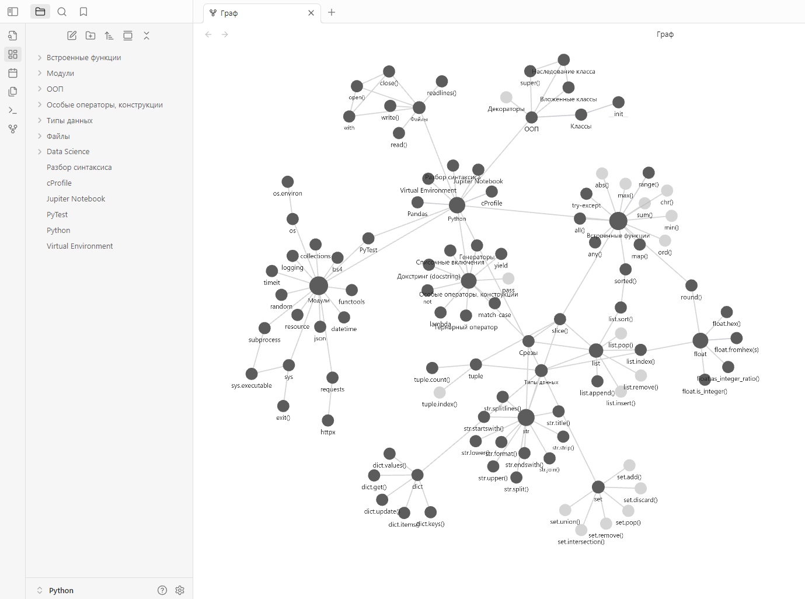
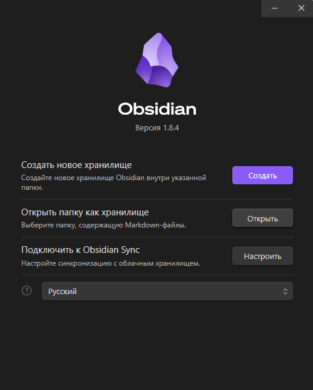

# python_notes

Заметки об изучении Python. Реализовано через Obsidian. Информация разделена по темам: встроенные функции, модули, ООП, особые операторы и конструкции языка, типы данных, файлы, Data Science и т.д.

> Можете использовать эти заметки в качестве справочного материала, либо брать структуру заметок за основу и создавать свои собственные конспекты в соответствии с ней. По моему опыту, информация усваивается гораздо легче, когда ее конспектируешь.

## Как пользоваться

1. Клонируйте репозиторий.
2. Установите [Obsidian](https://obsidian.md/).
3. Запустите программу.
4. Нажмите на кнопку `Открыть` в графе `Открыть папку как хранилище` и выберите директорию `python`.

